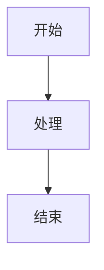

# 📚 GitHub Pages + Docsify 自动化文档部署设置

## 🎯 设置概述

已成功为AdaptiveRAG项目配置了GitHub Pages + Docsify的自动化文档部署系统，每次推送到main分支时会自动更新文档网站。

## ✅ 已完成的配置

### 1. Docsify 文档结构
```
docs/
├── index.html          # Docsify 主页面配置
├── README.md           # 文档首页
├── _coverpage.md       # 封面页
├── _sidebar.md         # 侧边栏导航
├── _navbar.md          # 顶部导航栏
├── _media/
│   └── logo.svg        # 项目Logo
├── architecture.md     # 架构文档
├── experiments.md      # 实验框架文档
└── diagrams.md         # 图表和可视化
```

### 2. GitHub Actions 工作流
- **文件位置**: `.github/workflows/docs.yml`
- **触发条件**: 推送到main分支且docs目录有变化
- **自动部署**: 构建并部署到GitHub Pages

### 3. Docsify 功能特性

#### 🎨 界面特性
- ✅ **现代化主题**: Vue.css主题
- ✅ **响应式设计**: 移动端友好
- ✅ **自定义样式**: 项目品牌色彩
- ✅ **封面页面**: 项目介绍和快速链接

#### 🔍 交互功能
- ✅ **全文搜索**: 实时搜索文档内容
- ✅ **代码复制**: 一键复制代码块
- ✅ **页面导航**: 上一页/下一页
- ✅ **标签页**: 多标签内容组织

#### 📊 图表支持
- ✅ **Mermaid图表**: 流程图、架构图、时序图
- ✅ **数学公式**: KaTeX数学渲染
- ✅ **代码高亮**: 多语言语法高亮
- ✅ **灵活警告**: 提示、警告、错误框

#### 🔧 Mermaid 配置详情
```javascript
// 支持的图表类型检测
if (lang === 'mermaid' || 
    code.match(/^sequenceDiagram/) || 
    code.match(/^graph/) || 
    code.match(/^gantt/) || 
    code.match(/^flowchart/) || 
    code.match(/^classDiagram/) || 
    code.match(/^stateDiagram/)) {
  html = '<div class="mermaid">' + code + '</div>';
}

// 主题配置
mermaid.initialize({ 
  startOnLoad: false,
  theme: 'default',
  themeVariables: {
    primaryColor: '#42b883',
    primaryTextColor: '#fff',
    primaryBorderColor: '#369870',
    lineColor: '#369870'
  }
});
```

## 🚀 使用方法

### 1. 启用GitHub Pages
1. 进入GitHub仓库设置
2. 找到"Pages"部分
3. 选择"GitHub Actions"作为源
4. 保存设置

### 2. 自动部署
每次推送到main分支时，如果docs目录有变化，会自动：
1. 构建文档
2. 部署到GitHub Pages
3. 更新文档网站

### 3. 访问文档
- **URL格式**: `https://username.github.io/repository-name/`
- **你的文档**: `https://rito-w.github.io/adaptiverag/`

> 📝 **注意**: GitHub Pages URL不是自定义域名，而是GitHub提供的子域名格式

## 📝 添加新文档

### 1. 创建Markdown文件
```bash
# 在docs目录下创建新文件
echo "# 新页面标题" > docs/new-page.md
```

### 2. 更新侧边栏
编辑 `docs/_sidebar.md`：
```markdown
* [🆕 新页面](new-page.md)
```

### 3. 使用Mermaid图表
````markdown

````

### 4. 推送更新
```bash
git add docs/
git commit -m "docs: add new documentation page"
git push origin main
```

## 🎨 自定义样式

### 修改主题色彩
编辑 `docs/index.html` 中的CSS变量：
```css
:root {
  --theme-color: #42b883;        /* 主题色 */
  --theme-color-dark: #369870;   /* 深色主题色 */
}
```

### 添加自定义CSS
在 `docs/index.html` 的 `<style>` 标签中添加：
```css
.custom-class {
  /* 自定义样式 */
}
```

## 📊 支持的图表类型

### Mermaid图表
- **流程图**: `flowchart` 或 `graph`
- **时序图**: `sequenceDiagram`
- **类图**: `classDiagram`
- **状态图**: `stateDiagram`
- **甘特图**: `gantt`
- **饼图**: `pie`
- **XY图表**: `xychart-beta`

### 使用示例
````markdown

````

## 🔧 高级配置

### 添加新插件
在 `docs/index.html` 中添加：
```html
<!-- 新插件CSS -->
<link rel="stylesheet" href="//cdn.jsdelivr.net/npm/plugin-name/dist/plugin.css">

<!-- 新插件JS -->
<script src="//cdn.jsdelivr.net/npm/plugin-name/dist/plugin.min.js"></script>
```

### 配置插件选项
在 `window.$docsify` 中添加：
```javascript
window.$docsify = {
  // 现有配置...
  
  // 新插件配置
  'plugin-name': {
    option1: 'value1',
    option2: 'value2'
  }
}
```

## 🎯 最佳实践

### 1. 文档组织
- 使用清晰的目录结构
- 保持文件名简洁明了
- 使用emoji增强可读性

### 2. 内容编写
- 使用标准Markdown语法
- 添加代码示例和图表
- 包含交互式元素

### 3. 维护更新
- 定期更新文档内容
- 检查链接有效性
- 优化图片和资源

## 🎉 部署状态

- ✅ **Docsify配置**: 完成
- ✅ **GitHub Actions**: 配置完成
- ✅ **Mermaid支持**: 已集成
- ✅ **主题定制**: 已应用
- ✅ **文档结构**: 已建立
- 🔄 **自动部署**: 等待推送触发

## 📞 故障排除

### 常见问题
1. **页面不显示**: 检查GitHub Pages设置
2. **图表不渲染**: 确认Mermaid语法正确
3. **样式异常**: 检查CSS语法和路径
4. **搜索不工作**: 确认搜索插件已加载

### 调试方法
1. 查看浏览器控制台错误
2. 检查GitHub Actions构建日志
3. 验证Markdown语法
4. 测试本地Docsify服务

---

🎯 **文档网站已准备就绪！每次推送都会自动更新，为你的AdaptiveRAG项目提供专业的在线文档。**
