# 🧠 AdaptiveRAG 文档

欢迎来到 **AdaptiveRAG** 的综合文档 - 一个智能的自适应检索增强生成系统，能够根据查询复杂度和上下文需求动态调整检索策略。

## 🌟 什么是 AdaptiveRAG？

AdaptiveRAG 是下一代 RAG 系统，超越了传统的静态检索方法。它智能地分析查询，分解复杂任务，并动态选择最优检索策略，以提供更准确和上下文相关的响应。

### 核心特性

- **🧠 智能查询分析**: 基于大语言模型的查询理解和任务分解
- **🔄 自适应检索策略**: 动态选择最优检索方法
- **🔗 多检索器融合**: 无缝集成关键词、密集向量和网络检索
- **📊 全面评估**: 与最先进方法的广泛基准测试
- **🔧 FlexRAG 集成**: 与 FlexRAG 组件深度集成，确保稳定性

## 🚀 快速开始

只需几个步骤即可开始使用 AdaptiveRAG：

### 安装

```bash
# 从 PyPI 安装
pip install adaptiverag

# 或从源码安装
git clone https://github.com/Rito-w/adaptiverag.git
cd adaptiverag
pip install -e .
```

### 基本用法

```python
from adaptive_rag import AdaptiveRAG

# 初始化 AdaptiveRAG
rag = AdaptiveRAG()

# 处理查询
result = rag.answer("量子计算的最新发展是什么？")
print(result.answer)
```

### 运行实验

```bash
# 快速测试
python quick_test.py

# 运行完整实验
python run_experiments.py full

# 消融研究
python run_experiments.py ablation
```

## 🏗️ 架构概览

AdaptiveRAG 由五个核心组件协同工作：

```mermaid
graph LR
    A[查询] --> B[任务分解器]
    B --> C[检索规划器]
    C --> D[多重检索器]
    D --> E[上下文重排器]
    E --> F[自适应生成器]
    F --> G[响应]
```



1. **任务分解器**: 将复杂查询分解为可管理的子任务
2. **检索规划器**: 根据查询类型选择最优检索策略
3. **多重检索器**: 融合多种检索方法的结果
4. **上下文重排器**: 优化检索到的上下文用于生成
5. **自适应生成器**: 产生高质量的响应

## 📊 性能表现

AdaptiveRAG 已在多个数据集上进行评估，并持续优于基线方法：

| 数据集 | 方法 | EM | F1 | ROUGE-L |
|---------|--------|----|----|---------|
| Natural Questions | AdaptiveRAG | **0.52** | **0.66** | **0.71** |
| | Naive RAG | 0.41 | 0.58 | 0.63 |
| | Self-RAG | 0.47 | 0.62 | 0.68 |
| HotpotQA | AdaptiveRAG | **0.38** | **0.51** | **0.58** |
| | Naive RAG | 0.29 | 0.42 | 0.49 |
| | Self-RAG | 0.34 | 0.47 | 0.54 |

> 📝 **注意**: 结果来自我们的实验框架。详细分析请参见 [基准测试](benchmarks.md)。

## 🧪 实验框架

AdaptiveRAG 包含一个受 FlashRAG 启发的综合实验框架：

- **标准化评估**: 兼容 FlashRAG 数据集和指标
- **基线比较**: 实现主要 RAG 方法
- **消融研究**: 详细的组件贡献分析
- **可重现结果**: 可配置的学术研究实验

## 🔗 集成

### FlexRAG 集成

AdaptiveRAG 与 FlexRAG 组件深度集成：

```python
from adaptive_rag.config import AdaptiveRAGConfig

config = AdaptiveRAGConfig(
    retrieval_methods=['keyword', 'dense', 'web'],
    reranking_enabled=True,
    flexrag_integration=True
)
```

### FlashRAG 兼容性

使用 FlashRAG 数据集和评估指标：

```python
from adaptive_rag.evaluation import BenchmarkRunner

runner = BenchmarkRunner(
    datasets=['natural_questions', 'hotpot_qa'],
    methods=['adaptive_rag', 'naive_rag'],
    flashrag_compatible=True
)
```

## 📚 文档结构

本文档分为以下几个部分：

- **[快速开始](installation.md)**: 安装、配置和基本使用
- **[核心概念](architecture.md)**: 深入了解 AdaptiveRAG 的架构
- **[集成指南](flexrag-integration.md)**: 如何与现有系统集成
- **[实验指南](experiments.md)**: 运行实验和评估
- **[API 参考](api/)**: 完整的 API 文档
- **[开发指南](development.md)**: 贡献和扩展 AdaptiveRAG

## 🤝 社区

加入我们不断壮大的社区：

- **GitHub**: [Rito-w/adaptiverag](https://github.com/Rito-w/adaptiverag)
- **问题反馈**: [报告错误或请求功能](https://github.com/Rito-w/adaptiverag/issues)
- **讨论**: [加入对话](https://github.com/Rito-w/adaptiverag/discussions)

## 📄 引用

如果您在研究中使用 AdaptiveRAG，请引用：

```bibtex
@article{adaptiverag2024,
  title={AdaptiveRAG: Intelligent Adaptive Retrieval-Augmented Generation},
  author={Your Name},
  journal={arXiv preprint arXiv:2024.xxxxx},
  year={2024}
}
```

## 📞 支持

需要帮助？我们为您提供支持：

- 📖 **文档**: 您正在阅读的内容！
- 🐛 **错误报告**: [GitHub Issues](https://github.com/Rito-w/adaptiverag/issues)
- 💬 **问题咨询**: [GitHub Discussions](https://github.com/Rito-w/adaptiverag/discussions)
- 📧 **邮箱**: adaptiverag@example.com

---

**准备开始了吗？** 查看我们的 [安装指南](installation.md) 或深入了解 [快速开始](quickstart.md) 教程！
