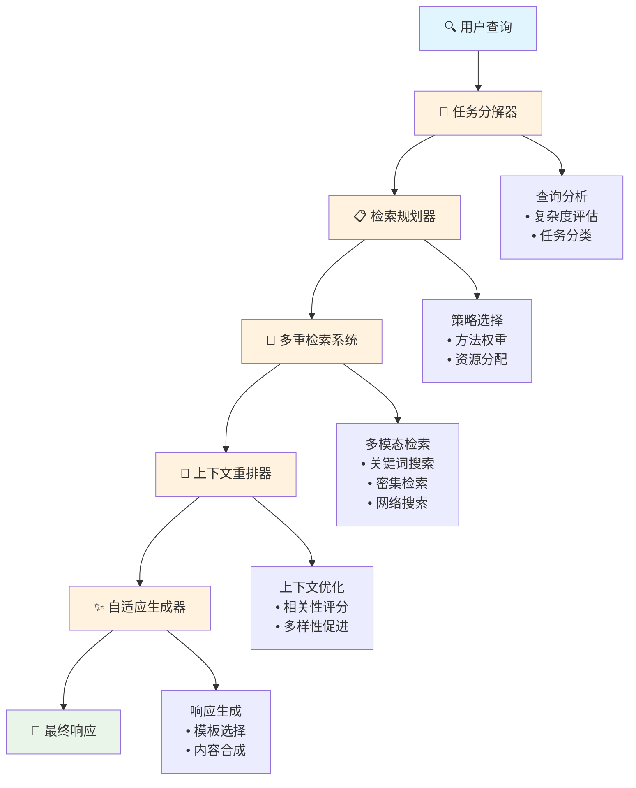
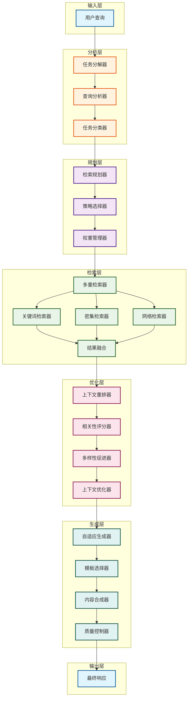

# 🏗️ 架构概览

AdaptiveRAG 基于模块化架构构建，能够根据查询特征和上下文需求智能地适应检索策略。

## 🎯 核心理念

AdaptiveRAG 遵循三个关键原则：

1. **自适应性**: 基于查询分析的动态策略选择
2. **模块化**: 可插拔组件，便于扩展和定制
3. **智能化**: 整个流水线中的 LLM 驱动决策

## 🔄 流水线流程



## 🏗️ 详细架构



## 🧩 组件详情

### 1. 任务分解器

**目的**: 分析并将复杂查询分解为可管理的子任务。

**关键特性**:
- LLM 驱动的查询理解
- 自动复杂度评估
- 子任务生成和优先级排序
- 任务类型分类（事实性、语义性、多跳等）

**示例**:
```python
decomposer = TaskDecomposer()
subtasks = decomposer.decompose("可再生能源与化石燃料的环境影响比较是什么？")
# 输出: [
#   "定义可再生能源",
#   "定义化石燃料能源",
#   "分析可再生能源的环境影响",
#   "分析化石燃料的环境影响",
#   "比较环境影响"
# ]
```

### 2. 检索规划器

**目的**: 为每个子任务选择最优检索策略。

**策略类型**:
- **基于关键词**: 用于事实性、具体查询
- **密集检索**: 用于语义相似性
- **网络搜索**: 用于最新信息
- **混合**: 多种方法的组合

**规划逻辑**:
```python
planner = RetrievalPlanner()
plan = planner.create_plan(subtasks)
# 输出: {
#   "subtask_1": {"method": "keyword", "weight": 0.7},
#   "subtask_2": {"method": "dense", "weight": 0.8},
#   "subtask_3": {"method": "hybrid", "weight": 0.9}
# }
```

### 3. 多重检索系统

**目的**: 使用多种方法执行检索并融合结果。

**支持的检索器**:
- **关键词检索器**: 基于 BM25 的稀疏检索
- **密集检索器**: 基于神经嵌入的检索
- **网络检索器**: 实时网络搜索集成
- **自定义检索器**: 用于特定领域检索器的可插拔架构

**融合策略**:
- 基于分数的融合
- 基于排名的融合
- 学习排序融合

### 4. 上下文重排器

**目的**: 优化检索到的上下文以提高生成质量。

**重排方法**:
- **交叉编码器**: 深度交互建模
- **ColBERT**: 高效的后期交互
- **自定义排序器**: 特定领域的排序模型

**上下文优化**:
- 相关性评分
- 多样性促进
- 长度优化
- 连贯性增强

### 5. 自适应生成器

**目的**: 使用优化的上下文生成响应。

**生成策略**:
- **基于模板**: 用于结构化响应
- **自由形式**: 用于创意和开放式查询
- **多轮对话**: 用于对话上下文
- **事实性**: 用于知识密集型任务

## 🔧 集成架构

### FlexRAG 集成

AdaptiveRAG 与 FlexRAG 组件深度集成：

```python
# FlexRAG 组件使用
from flexrag.retriever import RETRIEVERS
from flexrag.ranker import RANKERS
from flexrag.models import GENERATORS

# AdaptiveRAG 自动检测并使用 FlexRAG 组件
config = AdaptiveRAGConfig(
    flexrag_integration=True,
    retriever_types=['bm25', 'dpr', 'contriever'],
    ranker_types=['cross_encoder', 'colbert'],
    generator_types=['t5', 'gpt']
)
```

### 配置系统

具有多个来源的分层配置：

1. **默认配置**: 内置的合理默认值
2. **YAML 文件**: 人类可读的配置文件
3. **环境变量**: 运行时配置
4. **API 参数**: 程序化配置

```yaml
# config.yaml
adaptive_retrieval:
  enable_task_decomposition: true
  enable_strategy_planning: true
  enable_multi_retriever: true
  enable_reranking: true

retrieval_config:
  topk: 10
  fusion_method: "score_based"

generation_config:
  max_tokens: 256
  temperature: 0.1
```

## 📊 性能特征

### 可扩展性

- **水平扩展**: 多个检索器实例
- **垂直扩展**: GPU 加速支持
- **缓存**: 智能结果缓存
- **批处理**: 高效批处理

### 效率

- **延迟加载**: 按需加载组件
- **内存管理**: 优化内存使用
- **并行处理**: 并发检索和排序
- **资源监控**: 实时性能跟踪

## 🔍 监控和可观测性

### 日志记录

多级别的结构化日志：
- **系统**: 组件初始化和健康状态
- **请求**: 查询处理流水线
- **性能**: 时间和资源使用情况
- **调试**: 详细的内部状态

### 指标

关键性能指标：
- **延迟**: 端到端响应时间
- **吞吐量**: 每秒查询数
- **质量**: 检索和生成质量分数
- **资源使用**: CPU、内存、GPU 利用率

### 追踪

分布式追踪支持：
- **流水线追踪**: 跟踪查询通过所有组件
- **组件追踪**: 内部组件性能
- **外部追踪**: 与监控系统集成

## 🚀 可扩展性

### 插件架构

通过插件轻松扩展：

```python
# 自定义检索器插件
class CustomRetriever(BaseRetriever):
    def retrieve(self, query, top_k=10):
        # 自定义检索逻辑
        return results

# 注册插件
RETRIEVERS.register("custom", CustomRetriever)
```

### 事件系统

挂钩到流水线事件：

```python
# 事件处理器
def on_query_processed(event):
    print(f"查询已处理: {event.query}")
    print(f"结果: {len(event.results)}")

# 注册处理器
pipeline.on("query_processed", on_query_processed)
```

## 🔒 安全和隐私

### 数据保护

- **输入清理**: 查询验证和清理
- **输出过滤**: 响应内容过滤
- **隐私保护**: PII 检测和移除
- **审计日志**: 全面的审计跟踪

### 访问控制

- **身份验证**: 用户身份验证
- **授权**: 基于角色的访问控制
- **速率限制**: 请求节流
- **资源配额**: 每用户/组织的使用限制

---

这种架构使 AdaptiveRAG 能够提供智能、高效和可扩展的检索增强生成，同时保持定制和扩展的灵活性。
