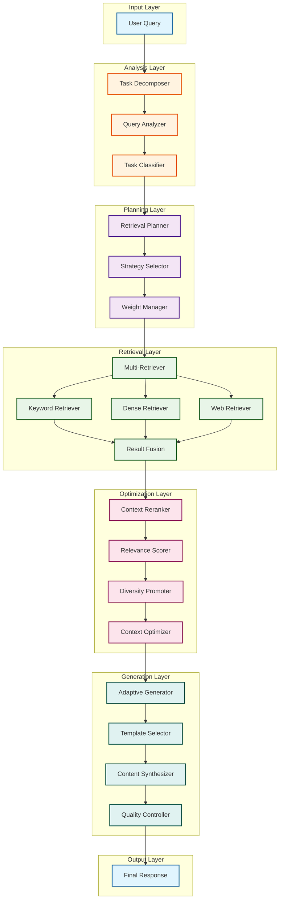

# 🏗️ Architecture Overview

AdaptiveRAG is built on a modular architecture that enables intelligent adaptation of retrieval strategies based on query characteristics and context requirements.

## 🎯 Core Philosophy

AdaptiveRAG follows three key principles:

1. **Adaptivity**: Dynamic strategy selection based on query analysis
2. **Modularity**: Pluggable components for easy extension and customization
3. **Intelligence**: LLM-driven decision making throughout the pipeline

## 🔄 Pipeline Flow

```mermaid
flowchart TD
    A[🔍 User Query] --> B[🧩 Task Decomposer]
    B --> C[📋 Retrieval Planner]
    C --> D[🔗 Multi-Retriever System]
    D --> E[🎯 Context Reranker]
    E --> F[✨ Adaptive Generator]
    F --> G[📝 Final Response]

    B --> H[Query Analysis<br/>• Complexity Assessment<br/>• Task Classification]
    C --> I[Strategy Selection<br/>• Method Weighting<br/>• Resource Allocation]
    D --> J[Multi-modal Retrieval<br/>• Keyword Search<br/>• Dense Retrieval<br/>• Web Search]
    E --> K[Context Optimization<br/>• Relevance Scoring<br/>• Diversity Promotion]
    F --> L[Response Generation<br/>• Template Selection<br/>• Content Synthesis]

    style A fill:#e1f5fe
    style G fill:#e8f5e8
    style B fill:#fff3e0
    style C fill:#fff3e0
    style D fill:#fff3e0
    style E fill:#fff3e0
    style F fill:#fff3e0
```



## 🏗️ Detailed Architecture



## 🧩 Component Details

### 1. Task Decomposer

**Purpose**: Analyzes and breaks down complex queries into manageable subtasks.

**Key Features**:
- LLM-driven query understanding
- Automatic complexity assessment
- Subtask generation and prioritization
- Task type classification (factual, semantic, multi-hop, etc.)

**Example**:
```python
decomposer = TaskDecomposer()
subtasks = decomposer.decompose("What are the environmental impacts of renewable energy compared to fossil fuels?")
# Output: [
#   "Define renewable energy sources",
#   "Define fossil fuel energy sources", 
#   "Analyze environmental impacts of renewable energy",
#   "Analyze environmental impacts of fossil fuels",
#   "Compare environmental impacts"
# ]
```

### 2. Retrieval Planner

**Purpose**: Selects optimal retrieval strategies for each subtask.

**Strategy Types**:
- **Keyword-based**: For factual, specific queries
- **Dense retrieval**: For semantic similarity
- **Web search**: For recent information
- **Hybrid**: Combination of multiple methods

**Planning Logic**:
```python
planner = RetrievalPlanner()
plan = planner.create_plan(subtasks)
# Output: {
#   "subtask_1": {"method": "keyword", "weight": 0.7},
#   "subtask_2": {"method": "dense", "weight": 0.8},
#   "subtask_3": {"method": "hybrid", "weight": 0.9}
# }
```

### 3. Multi-Retriever System

**Purpose**: Executes retrieval using multiple methods and fuses results.

**Supported Retrievers**:
- **Keyword Retriever**: BM25-based sparse retrieval
- **Dense Retriever**: Neural embedding-based retrieval
- **Web Retriever**: Real-time web search integration
- **Custom Retrievers**: Pluggable architecture for domain-specific retrievers

**Fusion Strategies**:
- Score-based fusion
- Rank-based fusion
- Learning-to-rank fusion

### 4. Context Reranker

**Purpose**: Optimizes retrieved context for generation quality.

**Reranking Methods**:
- **Cross-encoder**: Deep interaction modeling
- **ColBERT**: Efficient late interaction
- **Custom rankers**: Domain-specific ranking models

**Context Optimization**:
- Relevance scoring
- Diversity promotion
- Length optimization
- Coherence enhancement

### 5. Adaptive Generator

**Purpose**: Generates responses using optimized context.

**Generation Strategies**:
- **Template-based**: For structured responses
- **Free-form**: For creative and open-ended queries
- **Multi-turn**: For conversational contexts
- **Factual**: For knowledge-intensive tasks

## 🔧 Integration Architecture

### FlexRAG Integration

AdaptiveRAG deeply integrates with FlexRAG components:

```python
# FlexRAG component usage
from flexrag.retriever import RETRIEVERS
from flexrag.ranker import RANKERS
from flexrag.models import GENERATORS

# AdaptiveRAG automatically detects and uses FlexRAG components
config = AdaptiveRAGConfig(
    flexrag_integration=True,
    retriever_types=['bm25', 'dpr', 'contriever'],
    ranker_types=['cross_encoder', 'colbert'],
    generator_types=['t5', 'gpt']
)
```

### Configuration System

Hierarchical configuration with multiple sources:

1. **Default Configuration**: Built-in sensible defaults
2. **YAML Files**: Human-readable configuration files
3. **Environment Variables**: Runtime configuration
4. **API Parameters**: Programmatic configuration

```yaml
# config.yaml
adaptive_retrieval:
  enable_task_decomposition: true
  enable_strategy_planning: true
  enable_multi_retriever: true
  enable_reranking: true

retrieval_config:
  topk: 10
  fusion_method: "score_based"
  
generation_config:
  max_tokens: 256
  temperature: 0.1
```

## 📊 Performance Characteristics

### Scalability

- **Horizontal**: Multiple retriever instances
- **Vertical**: GPU acceleration support
- **Caching**: Intelligent result caching
- **Batching**: Efficient batch processing

### Efficiency

- **Lazy Loading**: Components loaded on demand
- **Memory Management**: Optimized memory usage
- **Parallel Processing**: Concurrent retrieval and ranking
- **Resource Monitoring**: Real-time performance tracking

## 🔍 Monitoring and Observability

### Logging

Structured logging at multiple levels:
- **System**: Component initialization and health
- **Request**: Query processing pipeline
- **Performance**: Timing and resource usage
- **Debug**: Detailed internal state

### Metrics

Key performance indicators:
- **Latency**: End-to-end response time
- **Throughput**: Queries per second
- **Quality**: Retrieval and generation quality scores
- **Resource Usage**: CPU, memory, GPU utilization

### Tracing

Distributed tracing support:
- **Pipeline Tracing**: Track query through all components
- **Component Tracing**: Internal component performance
- **External Tracing**: Integration with monitoring systems

## 🚀 Extensibility

### Plugin Architecture

Easy extension through plugins:

```python
# Custom retriever plugin
class CustomRetriever(BaseRetriever):
    def retrieve(self, query, top_k=10):
        # Custom retrieval logic
        return results

# Register plugin
RETRIEVERS.register("custom", CustomRetriever)
```

### Event System

Hook into pipeline events:

```python
# Event handler
def on_query_processed(event):
    print(f"Query processed: {event.query}")
    print(f"Results: {len(event.results)}")

# Register handler
pipeline.on("query_processed", on_query_processed)
```

## 🔒 Security and Privacy

### Data Protection

- **Input Sanitization**: Query validation and cleaning
- **Output Filtering**: Response content filtering
- **Privacy Preservation**: PII detection and removal
- **Audit Logging**: Comprehensive audit trails

### Access Control

- **Authentication**: User identity verification
- **Authorization**: Role-based access control
- **Rate Limiting**: Request throttling
- **Resource Quotas**: Usage limits per user/organization

---

This architecture enables AdaptiveRAG to provide intelligent, efficient, and scalable retrieval-augmented generation while maintaining flexibility for customization and extension.
