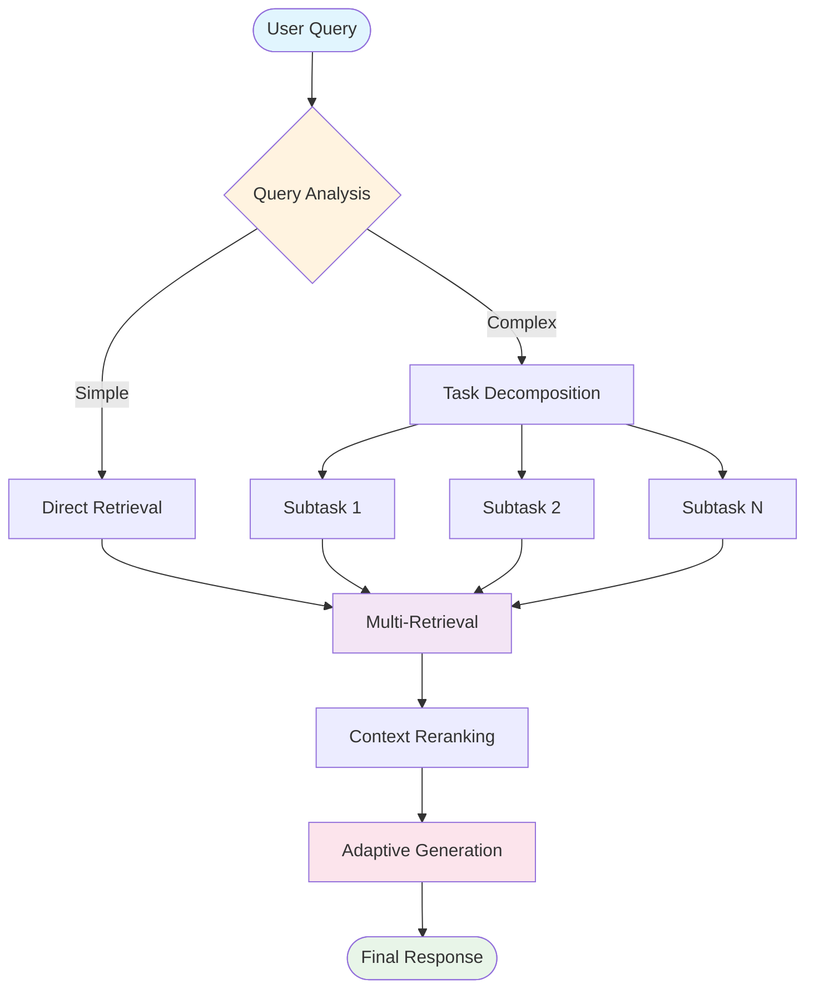
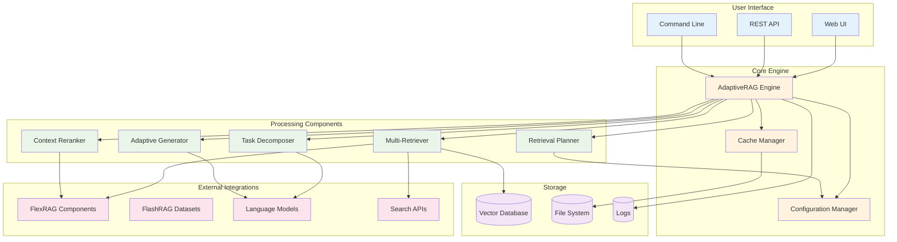
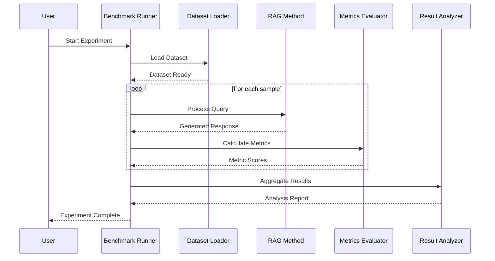
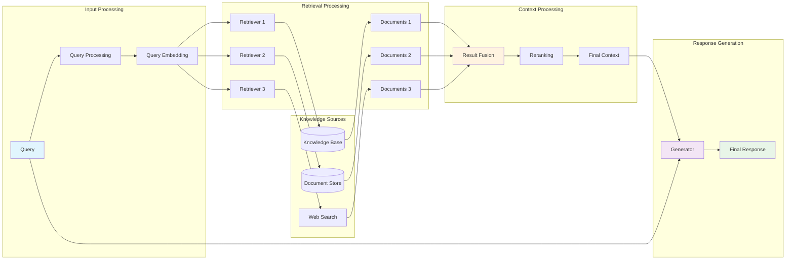
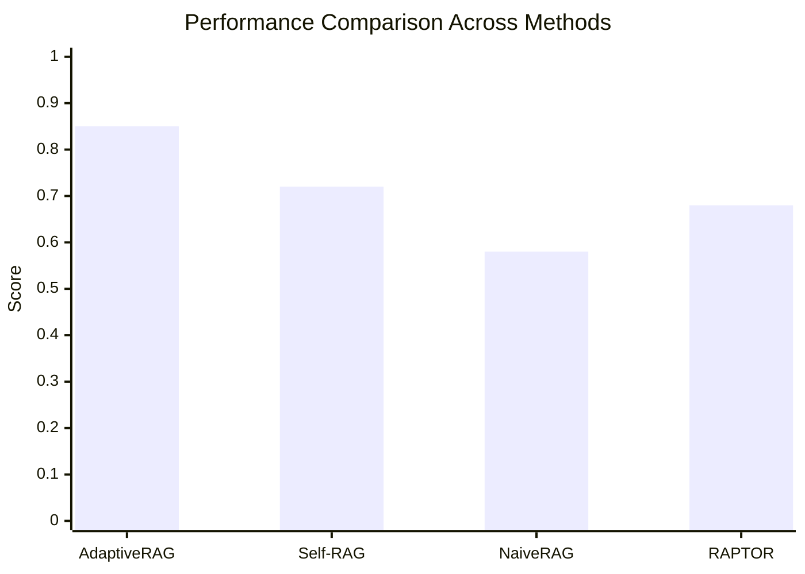
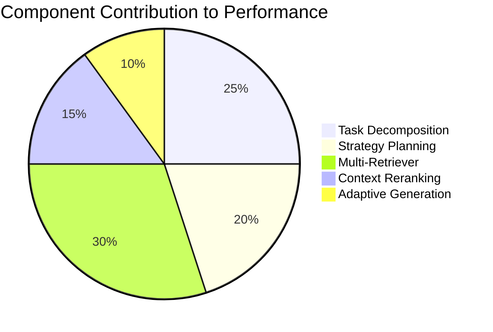

# 📊 Diagrams and Visualizations

This page demonstrates the various diagrams and visualizations used throughout the AdaptiveRAG documentation.

## 🔄 Process Flow Diagrams

### Basic Pipeline Flow


### Detailed Processing Pipeline



## 🏗️ Architecture Diagrams

### Component Architecture



## 📈 Experimental Flow

### Evaluation Pipeline



### Ablation Study Flow


## 🔍 Data Flow Diagrams

### Information Flow



## 📊 Performance Visualization

### Metric Comparison



### Component Contribution



## 🎯 Usage Examples

To include these diagrams in your documentation, simply use the `mermaid` code block:

````markdown

````

### Supported Diagram Types

- **Flowcharts**: `flowchart` or `graph`
- **Sequence Diagrams**: `sequenceDiagram`
- **Class Diagrams**: `classDiagram`
- **State Diagrams**: `stateDiagram`
- **Gantt Charts**: `gantt`
- **Pie Charts**: `pie`
- **XY Charts**: `xychart-beta`

### Styling Options

You can customize diagram appearance using:
- `classDef` for defining styles
- `class` for applying styles
- `style` for individual node styling
- Color themes and variables

---

These diagrams help visualize the complex architecture and processes within AdaptiveRAG, making the documentation more accessible and easier to understand.
