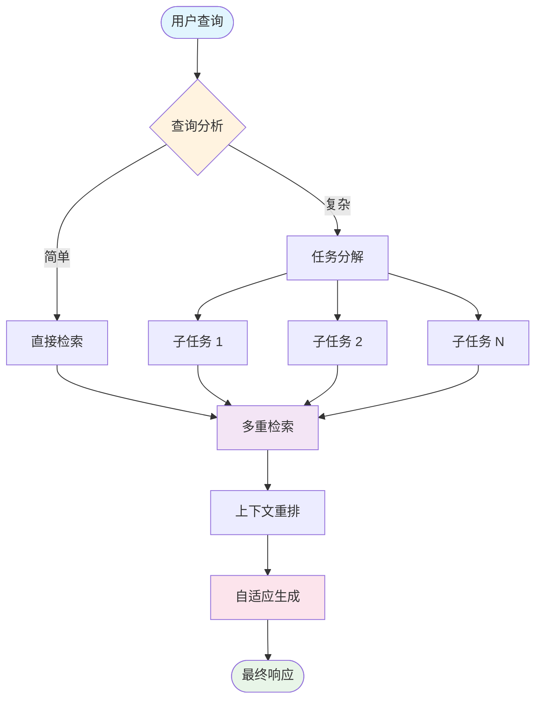
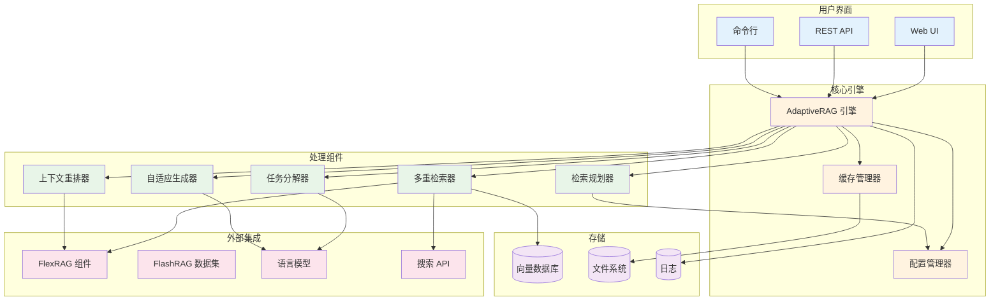
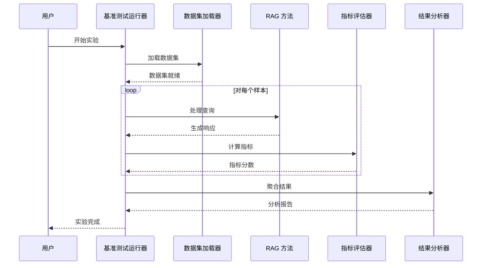
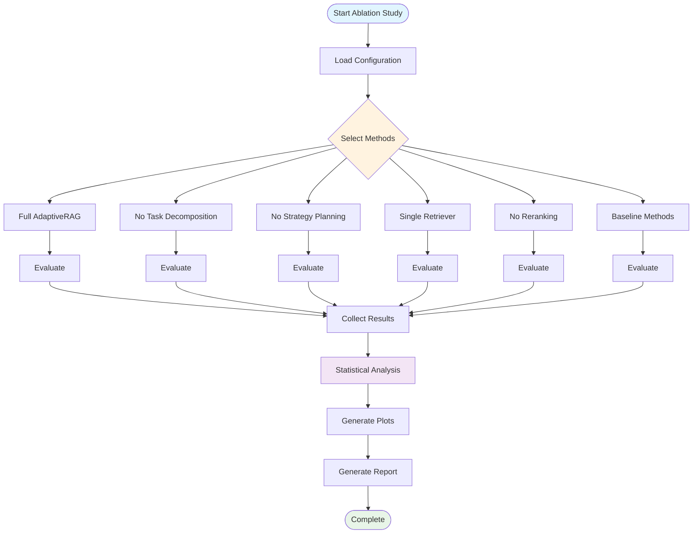
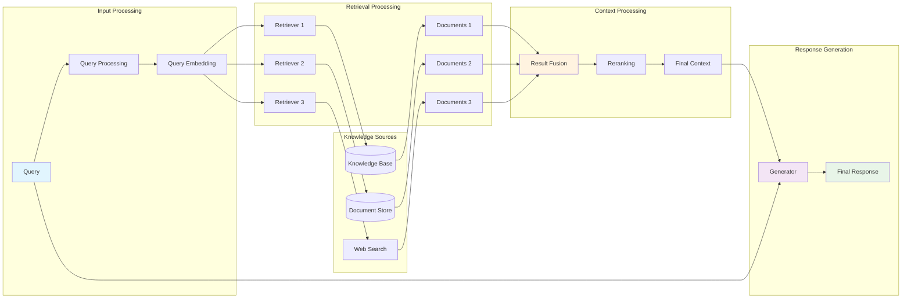
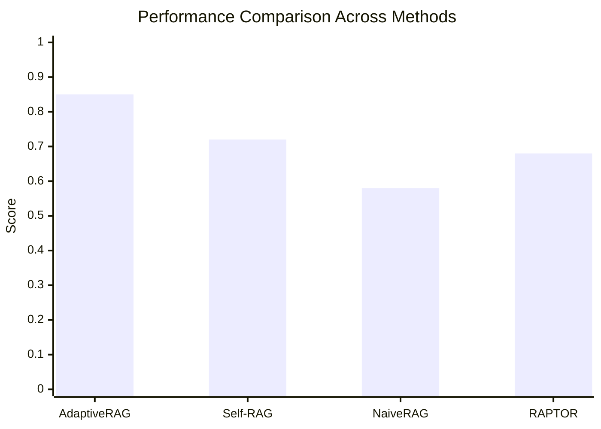
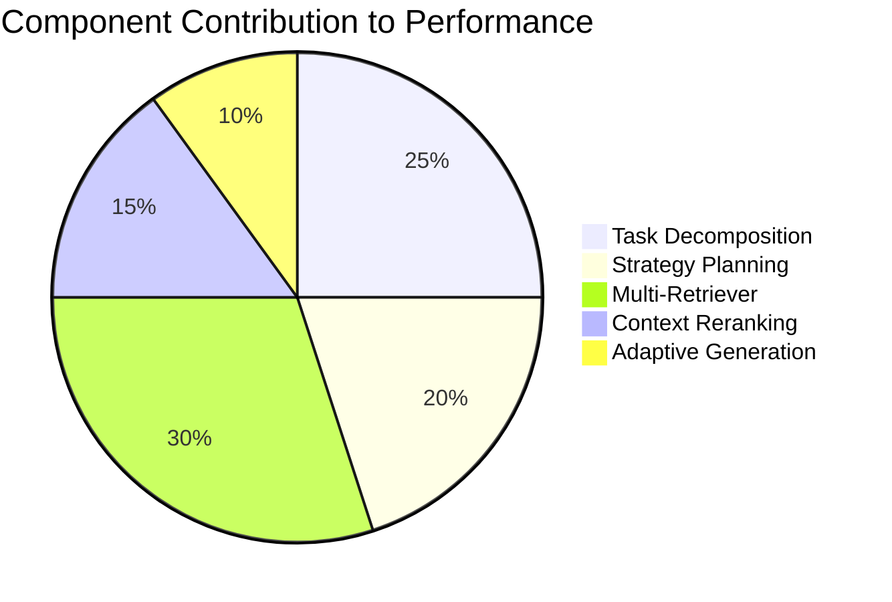

# 📊 图表和可视化

本页面展示了 AdaptiveRAG 文档中使用的各种图表和可视化内容。

## 🔄 流程图

### 基础流水线流程


### 详细处理流水线



## 🏗️ 架构图

### 组件架构



## 📈 实验流程

### 评估流水线



### Ablation Study Flow



## 🔍 Data Flow Diagrams

### Information Flow



## 📊 Performance Visualization

### Metric Comparison



### Component Contribution



## 🎯 Usage Examples

To include these diagrams in your documentation, simply use the `mermaid` code block:

````markdown

````

### Supported Diagram Types

- **Flowcharts**: `flowchart` or `graph`
- **Sequence Diagrams**: `sequenceDiagram`
- **Class Diagrams**: `classDiagram`
- **State Diagrams**: `stateDiagram`
- **Gantt Charts**: `gantt`
- **Pie Charts**: `pie`
- **XY Charts**: `xychart-beta`

### Styling Options

You can customize diagram appearance using:
- `classDef` for defining styles
- `class` for applying styles
- `style` for individual node styling
- Color themes and variables

---

These diagrams help visualize the complex architecture and processes within AdaptiveRAG, making the documentation more accessible and easier to understand.
