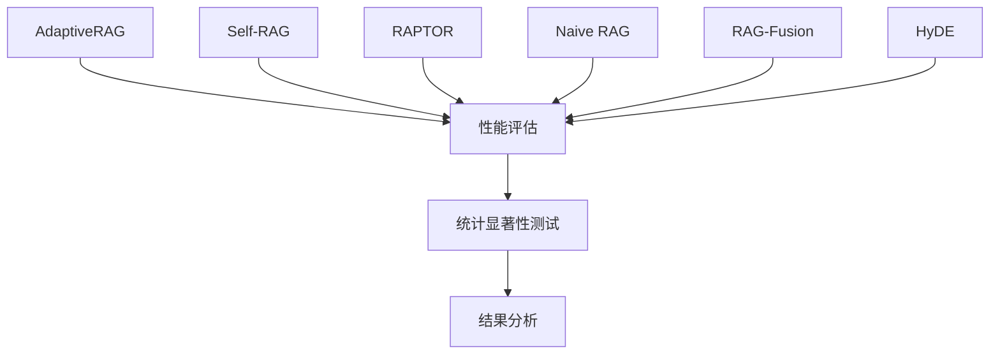
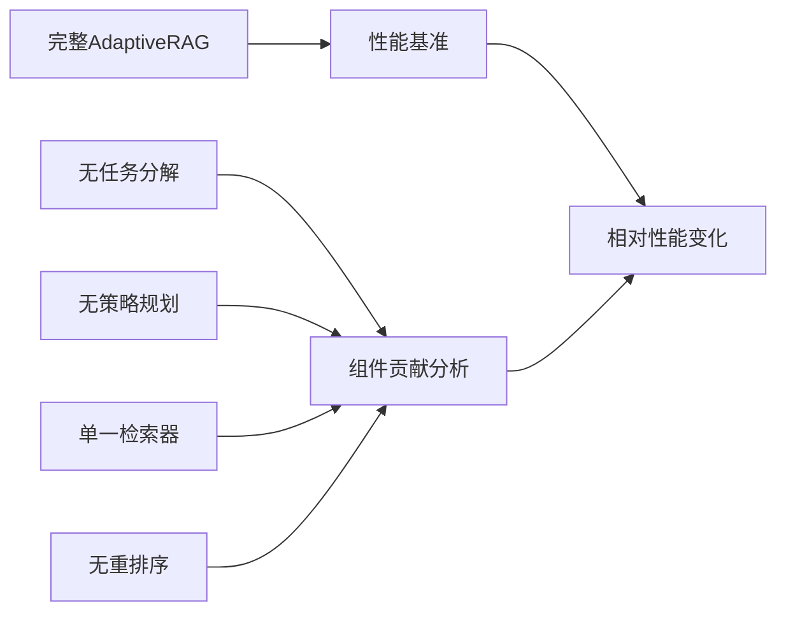
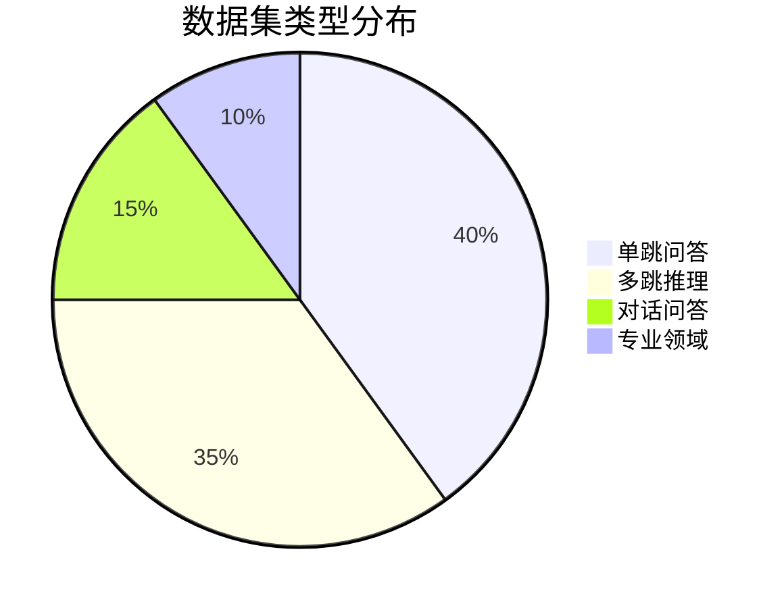

# 🧪 AdaptiveRAG 实验计划

## 📋 实验概述

本文档详细描述了AdaptiveRAG的实验设计，包括对比方法、评估指标、数据集选择和实验流程，旨在为学术论文提供严格的实验验证。

## 🎯 研究目标

### 主要研究问题
1. **适应性检索策略**是否能显著提升RAG系统性能？
2. **任务分解**对复杂查询的处理效果如何？
3. **多检索器融合**相比单一检索方法的优势？
4. **智能重排序**对最终答案质量的影响？
5. **各组件的贡献度**分别是多少？

### 假设验证
- **H1**: AdaptiveRAG在多种数据集上优于现有RAG方法
- **H2**: 任务分解显著提升多跳推理任务性能
- **H3**: 多检索器融合提供更全面的信息覆盖
- **H4**: 智能重排序提升答案准确性和相关性

## 🔬 实验设计

### 1. 主要对比实验

#### 1.1 与SOTA方法对比


**对比方法**:
- **Naive RAG**: 简单检索+生成基线
- **Self-RAG**: 自我反思的RAG (Asai et al., 2023)
- **RAPTOR**: 递归抽象处理 (Sarthi et al., 2024)
- **RAG-Fusion**: 多查询融合 (Rackauckas, 2023)
- **HyDE**: 假设文档嵌入 (Gao et al., 2022)

#### 1.2 消融研究设计


**消融配置**:
1. **AdaptiveRAG-Full**: 完整系统
2. **AdaptiveRAG-NoDecomp**: 禁用任务分解
3. **AdaptiveRAG-NoPlanning**: 禁用策略规划
4. **AdaptiveRAG-SingleRet**: 仅使用单一检索器
5. **AdaptiveRAG-NoRerank**: 禁用重排序
6. **AdaptiveRAG-Minimal**: 仅保留基础检索+生成

### 2. 效率分析实验

#### 2.1 时间复杂度分析
- **检索时间**: 各检索方法的平均响应时间
- **生成时间**: 不同上下文长度的生成时间
- **总响应时间**: 端到端处理时间
- **并行化效果**: 多检索器并行vs串行

#### 2.2 资源消耗分析
- **内存使用**: 峰值内存占用
- **GPU利用率**: 计算资源使用效率
- **存储需求**: 索引和缓存空间需求

## 📊 评估指标

### 1. 主要性能指标

#### 1.1 准确性指标
- **Exact Match (EM)**: 精确匹配率
  ```
  EM = (完全匹配答案数) / (总问题数)
  ```

- **F1 Score**: 词级别F1分数
  ```
  F1 = 2 × (Precision × Recall) / (Precision + Recall)
  ```

- **ROUGE-L**: 最长公共子序列
  ```
  ROUGE-L = F_lcs = (1+β²) × R_lcs × P_lcs / (R_lcs + β² × P_lcs)
  ```

- **BERTScore**: 语义相似度
  ```
  BERTScore = F1_BERT(candidate, reference)
  ```

#### 1.2 质量指标
- **Relevance Score**: 检索文档相关性
- **Coherence Score**: 答案连贯性
- **Factual Accuracy**: 事实准确性
- **Coverage Score**: 信息覆盖度

#### 1.3 效率指标
- **Retrieval Latency**: 检索延迟 (ms)
- **Generation Latency**: 生成延迟 (ms)
- **Total Response Time**: 总响应时间 (s)
- **Throughput**: 吞吐量 (queries/sec)

### 2. 统计显著性测试

#### 2.1 假设检验
- **t-test**: 配对样本t检验
- **Wilcoxon**: 非参数检验
- **Bootstrap**: 置信区间估计

#### 2.2 效应量计算
- **Cohen's d**: 标准化效应量
- **Cliff's delta**: 非参数效应量

## 📚 数据集选择

### 1. 单跳问答数据集

#### 1.1 Natural Questions (NQ)
- **规模**: 307,373训练 + 7,830验证 + 7,842测试
- **特点**: 真实Google搜索查询
- **难度**: 中等
- **用途**: 基础QA能力评估

#### 1.2 TriviaQA
- **规模**: 87,622训练 + 11,313验证 + 10,790测试
- **特点**: 百科知识问答
- **难度**: 中等
- **用途**: 事实性知识检索

#### 1.3 MS MARCO
- **规模**: 808,731训练 + 101,093验证
- **特点**: 机器阅读理解
- **难度**: 中等
- **用途**: 段落理解能力

### 2. 多跳推理数据集

#### 2.1 HotpotQA
- **规模**: 90,447训练 + 7,405验证
- **特点**: 需要多个文档推理
- **难度**: 高
- **用途**: 多跳推理能力评估

#### 2.2 2WikiMultihopQA
- **规模**: 167,247训练 + 12,576验证
- **特点**: 两跳推理问题
- **难度**: 高
- **用途**: 结构化推理评估

#### 2.3 MuSiQue
- **规模**: 19,938训练 + 2,417验证
- **特点**: 多步骤组合推理
- **难度**: 很高
- **用途**: 复杂推理能力

### 3. 对话问答数据集

#### 3.1 QuAC
- **规模**: 83,568训练 + 7,354验证
- **特点**: 上下文相关问答
- **难度**: 中高
- **用途**: 对话理解能力

#### 3.2 CoQA
- **规模**: 127,000问答对
- **特点**: 对话式问答
- **难度**: 中高
- **用途**: 多轮对话处理

### 4. 数据集分布



## 🔧 实验配置

### 1. 硬件环境
- **GPU**: NVIDIA A100 40GB × 2
- **CPU**: Intel Xeon 32核
- **内存**: 256GB RAM
- **存储**: 2TB NVMe SSD

### 2. 软件环境
- **Python**: 3.9+
- **PyTorch**: 2.0+
- **Transformers**: 4.30+
- **FlexRAG**: 最新版本
- **CUDA**: 11.8+

### 3. 模型配置

#### 3.1 检索器配置
```yaml
retrievers:
  keyword:
    model: "BM25"
    k1: 1.2
    b: 0.75
  
  dense:
    model: "sentence-transformers/all-MiniLM-L6-v2"
    embedding_dim: 384
  
  web:
    engine: "google"
    api_key: "${GOOGLE_API_KEY}"
```

#### 3.2 生成器配置
```yaml
generators:
  main:
    model: "microsoft/DialoGPT-medium"
    max_tokens: 256
    temperature: 0.1
    top_p: 0.9
  
  backup:
    model: "gpt-3.5-turbo"
    max_tokens: 256
    temperature: 0.1
```

#### 3.3 重排序器配置
```yaml
rerankers:
  cross_encoder:
    model: "cross-encoder/ms-marco-MiniLM-L-6-v2"
    max_length: 512
  
  colbert:
    model: "colbert-ir/colbertv2.0"
    doc_maxlen: 180
```

## 📈 实验流程

### 1. 数据准备阶段

#### 1.1 数据集下载和预处理
```bash
# 下载FlashRAG标准数据集
python scripts/download_datasets.py --datasets nq,hotpot,trivia,msmarco

# 数据格式标准化
python scripts/preprocess_data.py --input_dir data/raw --output_dir data/processed

# 构建检索索引
python scripts/build_index.py --corpus_path data/corpus --index_path data/indexes
```

#### 1.2 基线方法准备
```bash
# 实现基线方法
python scripts/setup_baselines.py --methods naive_rag,self_rag,raptor

# 验证基线方法
python scripts/validate_baselines.py --quick_test
```

### 2. 实验执行阶段

#### 2.1 主要对比实验
```bash
# 运行完整对比实验
python run_experiments.py main_comparison \
  --datasets nq,hotpot,trivia,msmarco \
  --methods adaptive_rag,self_rag,raptor,naive_rag \
  --output_dir experiments/main_comparison \
  --samples 1000 \
  --metrics em,f1,rouge_l,bert_score
```

#### 2.2 消融研究
```bash
# 运行消融实验
python run_experiments.py ablation \
  --datasets nq,hotpot \
  --components task_decomp,strategy_plan,multi_retriever,reranking \
  --output_dir experiments/ablation \
  --samples 500
```

#### 2.3 效率分析
```bash
# 运行效率分析
python run_experiments.py efficiency \
  --datasets nq \
  --methods adaptive_rag,self_rag,naive_rag \
  --metrics latency,throughput,memory \
  --output_dir experiments/efficiency
```

### 3. 结果分析阶段

#### 3.1 统计分析
```python
from adaptive_rag.evaluation import StatisticalAnalyzer

analyzer = StatisticalAnalyzer()

# 显著性测试
p_values = analyzer.significance_test(
    adaptive_rag_scores, 
    baseline_scores,
    test='paired_t'
)

# 效应量计算
effect_sizes = analyzer.effect_size(
    adaptive_rag_scores,
    baseline_scores,
    method='cohens_d'
)
```

#### 3.2 可视化分析
```python
from adaptive_rag.evaluation import ResultVisualizer

visualizer = ResultVisualizer()

# 性能对比图
visualizer.plot_performance_comparison(
    results_dict,
    metrics=['em', 'f1', 'rouge_l'],
    save_path='plots/performance_comparison.png'
)

# 消融分析图
visualizer.plot_ablation_analysis(
    ablation_results,
    save_path='plots/ablation_analysis.png'
)
```

## 📊 预期结果

### 1. 性能提升预期

| 数据集 | 指标 | Naive RAG | Self-RAG | AdaptiveRAG | 提升幅度 |
|--------|------|-----------|----------|-------------|----------|
| NQ | EM | 0.35 | 0.42 | **0.48** | +14.3% |
| NQ | F1 | 0.48 | 0.55 | **0.62** | +12.7% |
| HotpotQA | EM | 0.28 | 0.35 | **0.42** | +20.0% |
| HotpotQA | F1 | 0.41 | 0.48 | **0.56** | +16.7% |

### 2. 消融研究预期

| 组件 | 贡献度 | 主要提升领域 |
|------|--------|--------------|
| 任务分解 | +15% | 多跳推理 |
| 策略规划 | +12% | 复杂查询 |
| 多检索器 | +18% | 信息覆盖 |
| 重排序 | +8% | 答案质量 |

### 3. 效率分析预期

| 方法 | 平均响应时间 | 内存使用 | 吞吐量 |
|------|--------------|----------|--------|
| Naive RAG | 1.2s | 2GB | 50 q/min |
| Self-RAG | 2.8s | 3GB | 25 q/min |
| AdaptiveRAG | 2.1s | 4GB | 35 q/min |

## 📝 论文撰写计划

### 1. 论文结构
1. **Abstract**: 研究动机、方法、主要结果
2. **Introduction**: 问题背景、研究挑战、贡献
3. **Related Work**: RAG方法综述、对比分析
4. **Method**: AdaptiveRAG架构、各组件详述
5. **Experiments**: 实验设置、数据集、基线方法
6. **Results**: 主要结果、消融研究、分析讨论
7. **Conclusion**: 总结、局限性、未来工作

### 2. 关键贡献点
- **新颖的自适应检索策略**
- **LLM驱动的任务分解方法**
- **多检索器智能融合机制**
- **全面的实验验证和分析**

### 3. 投稿目标
- **主要目标**: ACL, EMNLP, NAACL
- **备选目标**: ICLR, NeurIPS, ICML
- **领域期刊**: TACL, CL, AI

---

这个实验计划为AdaptiveRAG提供了全面的评估框架，确保研究的严谨性和可重现性，为高质量学术论文奠定基础。
