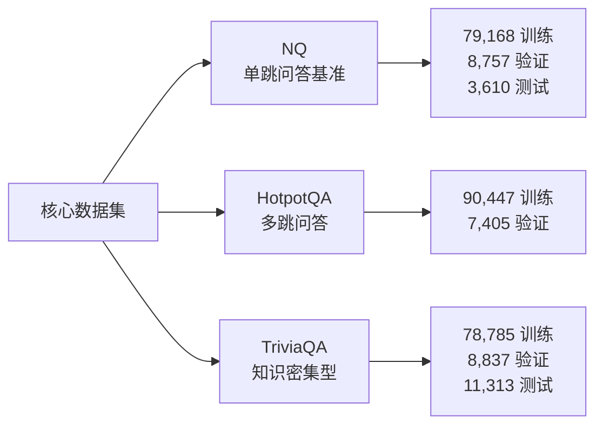
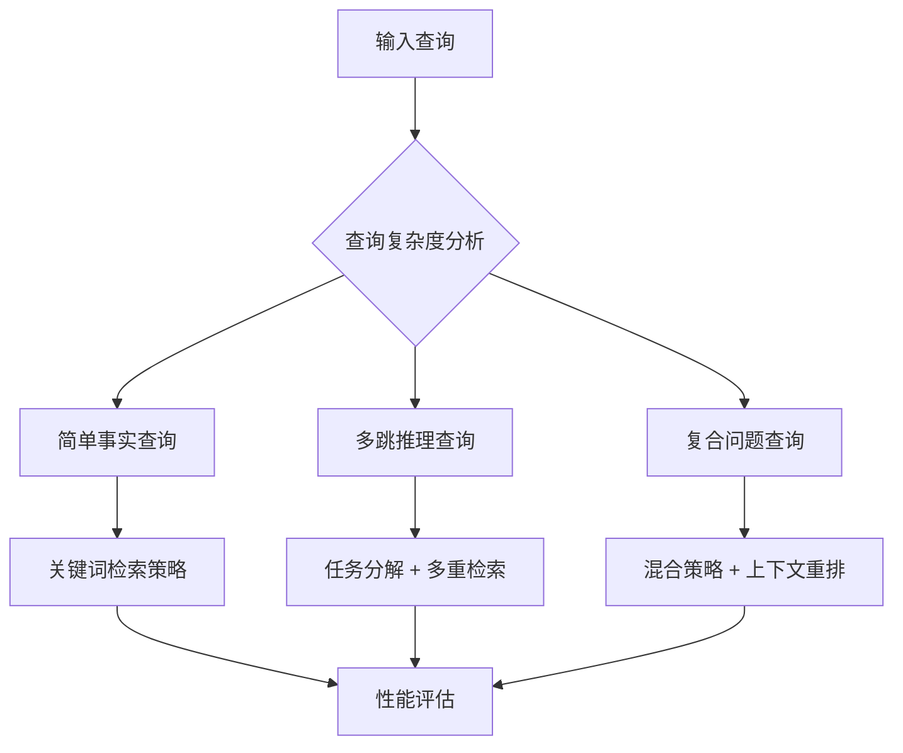
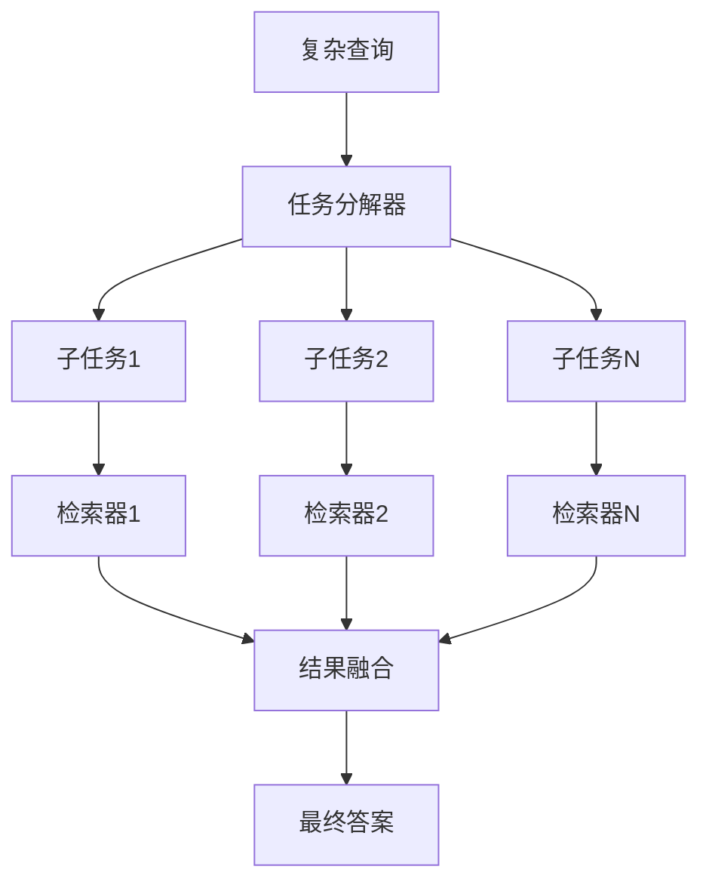
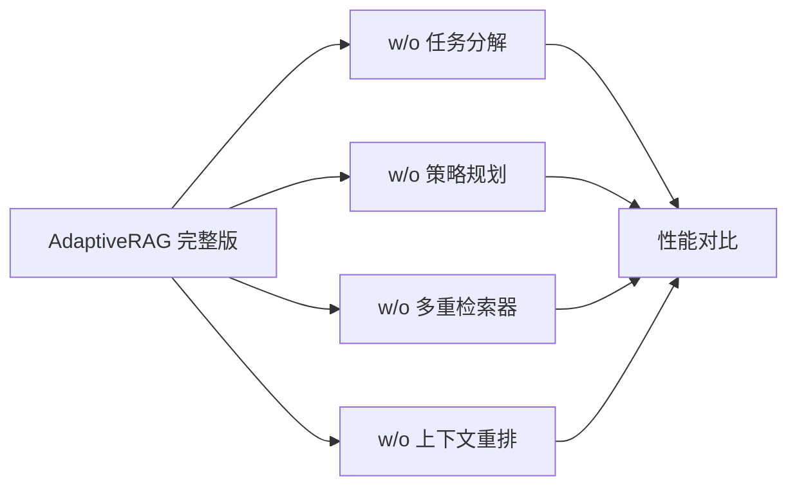
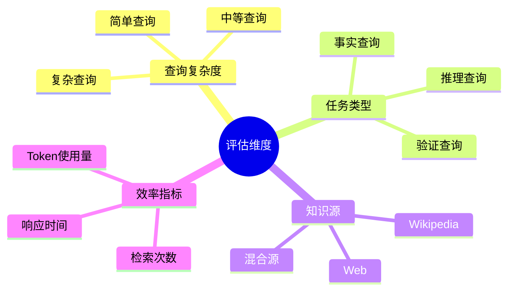

# 🧪 AdaptiveRAG 实验设计方案

## 🎯 实验目标

基于 FlashRAG 基准数据集，设计全面的实验来验证 AdaptiveRAG 的创新价值和性能优势。

## 📊 数据集选择策略

### Tier 1 - 核心基准数据集



**选择理由**：
- **NQ (Natural Questions)**: 单跳问答基准，测试基础检索能力
- **HotpotQA**: 多跳问答，验证任务分解和推理能力  
- **TriviaQA**: 知识密集型问答，测试检索准确性

### Tier 2 - 创新验证数据集

- **2WikiMultiHopQA**: 复杂多跳推理，突出自适应策略优势
- **ASQA**: 长文本问答，验证上下文优化能力
- **FEVER**: 事实核验，测试检索精确度

### Tier 3 - 挑战性数据集

- **PopQA**: 流行文化问答，测试领域适应性
- **Musique**: 复合推理，验证复杂查询处理
- **StrategyQA**: 策略性推理，测试智能分解能力

## 🏆 对比方法选择

### 强基线方法

| 方法 | 类型 | NQ (EM) | TriviaQA (EM) | HotpotQA (F1) | 特点 |
|------|------|---------|---------------|---------------|------|
| **Spring** | Sequential | 37.9 | 64.6 | 42.6 | 当前最佳性能 |
| **Ret-Robust** | Loop | 42.9 | 68.2 | 35.8 | 性能标杆 |
| **Standard RAG** | Sequential | 35.1 | 58.9 | 35.3 | 基础对比 |

### 同类型方法

- **Adaptive-RAG**: 直接对比同类自适应方法
- **Self-RAG**: 迭代方法代表
- **IRCoT**: 推理链方法

### 特色方法

- **RECOMP-abstractive**: 上下文压缩方法
- **R1-Searcher**: 最新推理方法

## 🚀 创新实验设计

### 1. 查询复杂度自适应实验



**实验内容**：
- 查询分类准确性测试
- 自适应策略选择效果验证
- 固定策略 vs 自适应策略性能对比

### 2. 多重检索器融合分析

```python
# 检索器组合消融研究
retriever_combinations = [
    ["keyword_only"],           # BM25
    ["dense_only"],            # DPR  
    ["web_only"],              # Web Search
    ["keyword", "dense"],       # 混合
    ["keyword", "dense", "web"] # 完整融合
]
```

### 3. 任务分解效果验证



## 🔬 系统消融研究

### 核心组件消融



1. **AdaptiveRAG (完整版)** - 基准性能
2. **w/o 任务分解** - 验证分解价值  
3. **w/o 策略规划** - 验证自适应价值
4. **w/o 多重检索器** - 验证融合价值
5. **w/o 上下文重排** - 验证优化价值

### 策略选择消融

- 固定权重 vs 动态权重
- 规则基础 vs 学习基础策略选择
- 不同权重分配算法对比

## 📈 评估指标体系

### 主要性能指标

- **EM (Exact Match)**: 精确匹配率
- **F1 Score**: Token级别F1分数  
- **Accuracy**: 整体准确率

### 创新指标

- **策略选择准确率**: 自适应策略选择的正确性
- **任务分解质量**: 分解合理性评分
- **检索融合效果**: 多检索器协同效果
- **响应时间**: 效率对比

### 分析维度



## 🎯 预期创新贡献

1. **智能查询分析**: 基于LLM的查询复杂度评估和任务分解
2. **动态策略选择**: 根据查询特征自动选择最优检索策略
3. **多模态检索融合**: 关键词、密集向量、网络检索的智能融合
4. **自适应权重分配**: 动态调整不同检索方法的权重
5. **端到端优化**: 从查询分析到结果生成的全流程优化

## 📊 预期性能目标

基于现有最佳方法的性能，AdaptiveRAG的目标：

| 数据集 | 当前最佳 | AdaptiveRAG目标 | 提升幅度 |
|--------|----------|----------------|----------|
| NQ (EM) | 42.9 (Ret-Robust) | 45+ | +5% |
| TriviaQA (EM) | 68.2 (Ret-Robust) | 70+ | +3% |
| HotpotQA (F1) | 59.5 (R1-Searcher) | 62+ | +4% |
| 2Wiki (F1) | 55.5 (R1-Searcher) | 58+ | +5% |

## 🔄 实验执行计划

### 阶段一：基础性能验证 (2周)
- 在核心数据集上与主要基线方法对比
- 验证基础功能正确性

### 阶段二：创新功能验证 (3周)  
- 查询复杂度自适应实验
- 多重检索器融合分析
- 任务分解效果验证

### 阶段三：深度分析 (2周)
- 系统消融研究
- 错误案例分析
- 性能瓶颈识别

### 阶段四：扩展验证 (1周)
- 挑战性数据集测试
- 跨领域泛化能力验证
- 效率和可扩展性分析

## 📝 实验配置

### 统一实验设置
- **生成器**: Llama3-8B-instruct
- **检索器**: E5-base-v2 (检索Top-5文档)
- **评估指标**: EM, F1, 准确率
- **硬件环境**: GPU集群，支持并行实验

### 可重现性保证
- 固定随机种子
- 详细的超参数记录
- 完整的实验日志
- 开源代码和数据

这套实验设计能够全面验证AdaptiveRAG的创新价值，并在多个维度上展示其相对于现有方法的优势！
